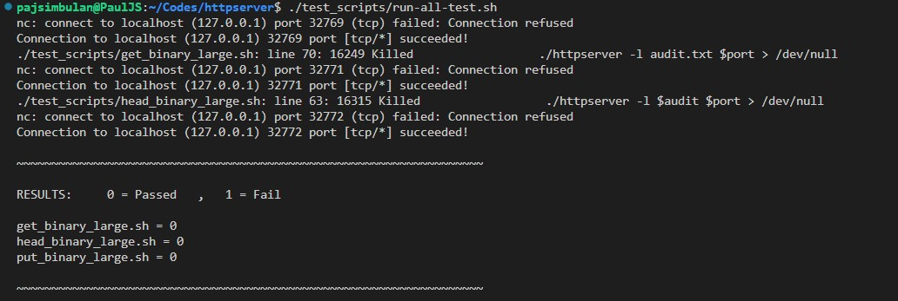
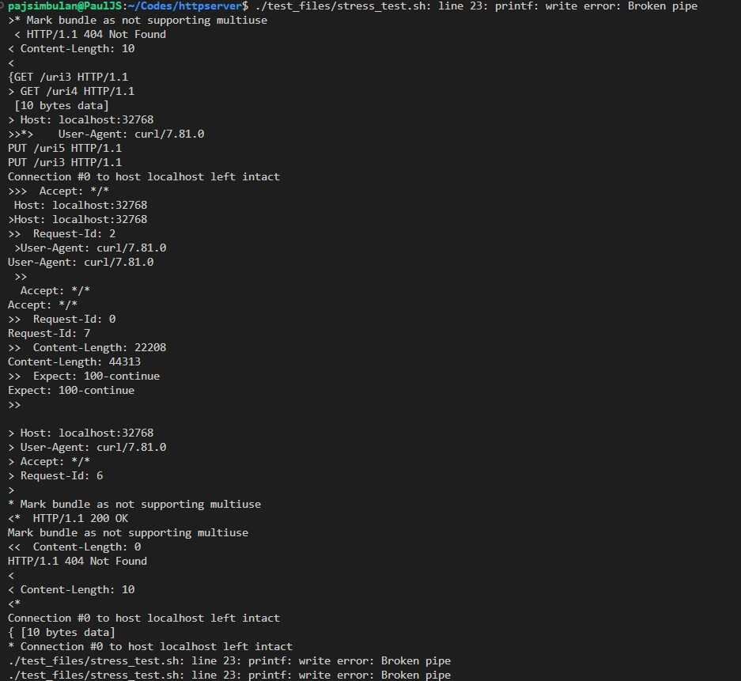
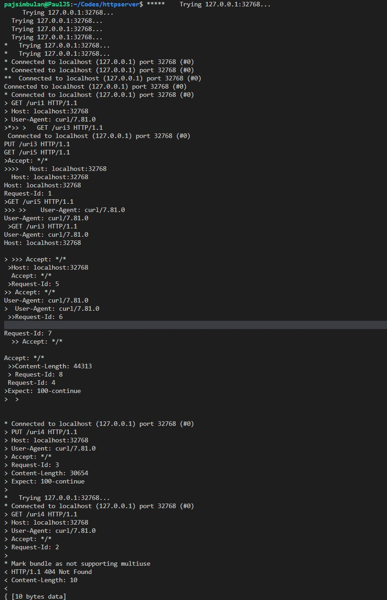
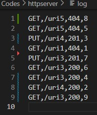

# Multi-threaded HTTP Server 1.1 in C

This repository contains a basic implementation of an HTTP server using C language and POSIX threads. The server uses both single-thread and multi-threaded model to handle incoming client connections and serve HTTP requests.  Mutex lock with conditions is implemented on a queue to provide a thread-safety queue

## Functionalities

The server supports the following HTTP methods:

- `GET`: Responds to the client with the content of the requested URI and a status code indicating the success or failure of the request.
- `PUT`: Allows a client to add or create new data on the server by specifying a URI.
- `HEAD`: Similar to the `GET` method, but only returns the status of the requested file without its content.

## Components

The server implementation consists of the following source files:

1. `httpserver.c`: The main file for the server, where the server is initialized, and the incoming connections are handled by worker threads.
2. `bind.c` and `bind.h`: These files contain the implementation of a function to create a listening socket. The function takes a port number as an argument, binds to it, and listens for incoming connections.
3. `queue.c` and `queue.h`: These files contain the implementation of a thread-safe queue data structure. The queue is used to store client connections to be processed by worker threads.
4. `Makefile`: The Makefile is used to build the server program using the `clang` compiler with strict warning flags.

## Building

To build the server program, run the following command in the terminal:

```sh
make

```
## Usage
To start the server, run the following command:

```sh
./httpserver <port>
```

Replace <port> with the desired port number on which the server should listen for incoming connections.

# Running Tests

<br />

## Single-Threaded Tests
1. Ensure that the **test_files** and **test_scripts** directories are in the same directory as the **httpserver** binary file.<br />
2. Execute the test scripts from the same directory as httpserver. For example, 
```sh
 ./test_scripts/put_binary_large.sh.
```

 
3. Run 
```sh
 ./test_scripts/run-all-tests.sh
``` 
  to run all single-threaded tests.<br />
  
4. Tests return 0 for success and a non-zero value for failure.<br /> <br /> <br /> 

## Multi-Threaded Tests
Requirements:<br />

- Python 3.9 installed<br />
1. Run 
```sh
./test_scripts/stress_test_runner.sh
```
to run multi-threaded tests.<br />

Note: **stress_test_runner.sh** has parameters you can change:

- **threads**: number of threads
- **seed**: helps guarantee deterministic results
- **num_requests**: number of requests to send
- **num_uris**: number of unique URIs to generate
- **num_files**: number of unique files to generate
<br />
Make sure to delete the produced files and URIs by the program after each test. Run rm file* and rm uri* to delete most files.

# Screenshots 

**Server Listening**
<br />

<br /><br />

**Single Thread Test**
<br />

<br /><br />

**Multi-thread Test 1**
<br />

<br /><br />

**Multi-thread Test 2**
<br />

<br /><br />

**Multi-thread Log**
<br />

<br /><br />


# License
This project is open-source and available under the MIT License.


